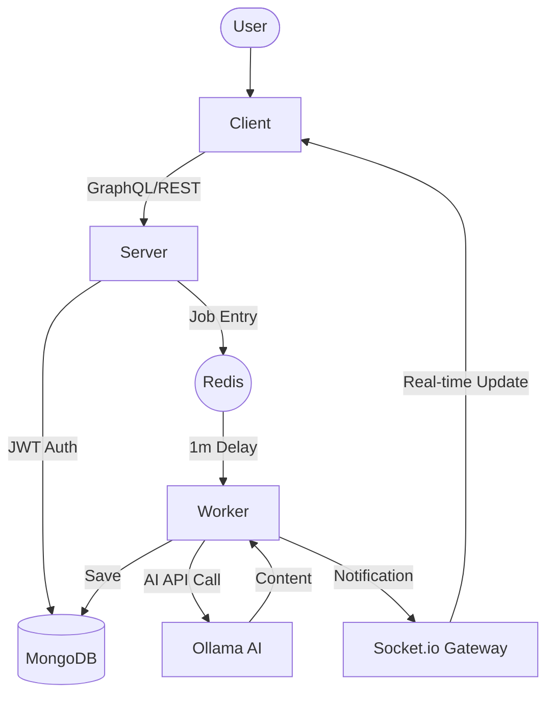

# Project Walkthrough: Smart Content Generator

This document provides a summary of the completed work, demonstrating how each requirement was met.

## 🏗️ Architecture Overview

The system is built as a distributed application with four primary services orchestrated by Docker Compose:

1. **Client (Next.js)**: A premium React frontend with real-time state management.
2. **Server (NestJS)**: An API gateway that handles authentication, CRUD, and job submission.
3. **Worker (NestJS)**: A dedicated process for consuming jobs from the Redis queue and interacting with Ollama.
4. **Database & Cache**: MongoDB for persistence and Redis for the job queue.



## ✨ Features Demonstration

### 1. Secure Authentication & Dashboard
- **JWT-based Auth**: Implemented via Passport.js on the backend and a custom `AuthContext` on the frontend.
- **Responsive Dashboard**: Features predictive search that filters content in real-time as the user types.

### 2. Smart Content Generation (with 1-minute delay)
- When a user submits a prompt, the server responds immediately with an `HTTP 202 Accepted` status and a Job ID.
- The job remains in the Redis queue for exactly **60,000 milliseconds** before being processed.

### 3. Real-Time Updates (WebSockets)
- Instead of polling, the client listens to a Socket.io channel unique to the user ID.
- Once the AI generation is complete, the worker pushes the result directly to the UI.

### 4. AI Enhancement: Sentiment Analysis
- Every piece of generated content undergoes a secondary AI pass to determine its sentiment (Positive, Neutral, Negative) and score, displayed on the dashboard cards.

## 🧪 Verification & Proof of Work

### Backend Unit Tests
We verified the core logic using Jest. All tests passed successfully.
```bash
Test Suites: 3 passed, 3 total
Tests:       5 passed, 5 total
```

### Dockerized Environment
The entire stack is ready for deployment with a single command:
```bash
docker-compose up --build
```

### Real-Time Update Sequence
1. User clicks **Generate**. 
2. UI shows "Job queued! Please wait 1 minute...".
3. After exactly 60s, the worker picks up the job.
4. UI automatically navigates to the dashboard or shows a "Success" toast once the WebSocket event is received.
